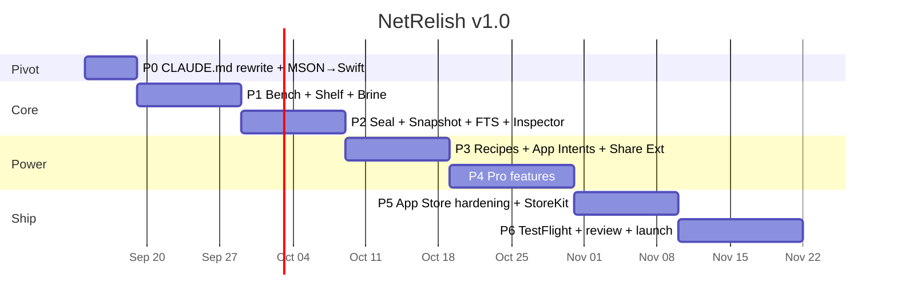

# NetRelish — Plan and Roadmap to App Store v1.0

**Savor the web. Get more done.**

Native macOS workbench. Capture the web into a Pantry, sort it into Jars, run Recipes on it, Seal what matters. The only browser whose intelligence works on what you've *kept*, not what you're *logged into*.

Status: direction pivot confirmed Sept 2026. Tauri/React Week 1 is sunk cost; this document replaces the prior roadmap and supersedes the Tauri, React, and not-App-Store decisions in `CLAUDE.md`.

---

## 1 · Positioning

### The field (Sept 2026)
Atlas, Comet, Dia, Brave Leo, Opera Neon. All Chromium. All shipping agents that read your tabs and act inside your logged-in sessions. All exposed to prompt injection they can't close. Arc is in maintenance mode.

### The wedge
NetRelish's agent operates on **sealed snapshots only**. It cannot see a live tab, cannot click, cannot submit. It reads what you chose to keep. That closes the attack surface the whole field is bleeding from, and it's a *consequence of the architecture*, not a slogan.

> Local-only is an engineering constraint (speed and scope). It is not the marketing tagline. The tagline is the workbench. The security property is a proof point, listed third, not first.

### Who pays
Designers, developers, researchers, lawyers, consultants — people whose job is to *keep receipts on the web*. They already pay for read-later apps, archiving tools, and screenshot managers separately. NetRelish is those three things in the thing they already have open.

---

## 2 · Principles (non-negotiable)

1. **One `Item` table.** `kind` is the discriminator. Never per-kind tables.
2. **Brine is a query, not a place.** `jar == nil`.
3. **Seal is an action, not a place.** Stamps `sealedAt`, freezes the snapshot, fires Recipes.
4. **Intelligence reads the Pantry only.** No AI touches a live `WKWebView`. Ever.
5. **Browsing data never leaves the device.** Cloud = billing only.
6. **Open-core.** Code MIT, brand all rights reserved.
7. **System Designer is the design of record.** MSON → Claude Code → Swift. Model changes start in the diagram.

---

## 3 · Platform decisions

| Decision | Choice | Rationale |
|---|---|---|
| Language / UI | Swift 6, SwiftUI, AppKit escape hatches | Native App Intents, Liquid Glass, Spotlight, Share Extension. Chromium apps can't be first-class here. |
| OS floor | macOS 27 Golden Gate | Ships Sept 14. Apple-silicon-only. Visual Intelligence on Mac, Safari automation APIs, Liquid Glass transparency controls. |
| Web engine | WKWebView (WebKit) | Native `.webarchive` snapshots. Sandbox-friendly. No Chromium payload. |
| Storage | GRDB.swift over SQLite, FTS5, sqlite-vec | Background-safe writes from the Share Extension. Real migrations. SwiftData `@Model` file is the *shape*, GRDB is the engine. |
| Intelligence | Foundation Models (on-device) first, MLX Swift for opt-in bigger models | Zero network. Summarize, extract tasks, embed. |
| Distribution | Mac App Store (primary) + Developer ID direct (secondary, same binary) | App Store for reach and StoreKit. Direct for the crowd that won't. |
| Billing | StoreKit 2 (App Store) · Stripe + Supabase license keys (direct) | Neither touches browsing data. |
| Content extraction | Defuddle (MIT) in the WKWebView on capture | Clean `body` text. Skip SingleFile (AGPL). |
| Voice | WhisperKit (MIT) | Voice → `note` Item. Later. |
| Sync | Automerge-swift via iCloud Drive | Post-1.0, for Duo companion. |

---

## 4 · Feature ladder

### Free — fill the Pantry
- Bench: WKWebView tabs, split view, ⌘K palette
- Shelf: unlimited Jars
- Brine tray, capture (⌘D), drag-to-jar
- Seal: `.webarchive` snapshot + FTS5 index + tab closes
- Inspector: labels, kind, source, summary (on-device)
- 3 Recipes
- Share Extension, Spotlight indexing, Quick Look
- Visual Intelligence on screenshots/clips
- Full-text search

### Pro — turn the Pantry into work product
- **Reseal + diff** — visual diff between seals of the same URL
- **Provenance stamp** — content hash + timestamp per Seal; exportable proof
- **Jar bundles** — signed `.jar` export/import, AirDrop-shareable
- **Unlimited Recipes** + every Recipe as an App Intent (Siri, Shortcuts, Action button, Focus)
- **Bench splits with linked scroll** — sealed vs live, sealed vs sealed
- **Semantic search** — sqlite-vec over every sealed body
- **Duo companion** (iOS, post-1.0)

Pricing: annual + lifetime. One tier. Free is generous so the Pantry fills; it's their data on their disk, which is the honest kind of lock-in.

---

## 5 · Roadmap — 12 weeks to App Store review



### P0 · Pivot (Sep 14–18)
- Rewrite `CLAUDE.md` non-negotiables: Swift, macOS 27, App Store, GRDB, WKWebView, FM on-device
- System Designer bundle synced to `/design/NetRelish.json`
- Claude Code generates `Models.swift` from MSON; review diff
- Xcode project, SwiftLint, CI signing with Developer ID
- **Demo:** empty app launches, Pantry DB migrates, `capture()` creates an Item from a Shortcut
- **Done when:** the schema round-trips MSON → Swift → SQLite with zero hand-edits

### P1 · Bench + Shelf + Brine (Sep 21 – Oct 2)
- Shelf rail: icon-only Jars, ⌘1–9, Liquid Glass, superellipse n=5
- Bench: tab strip, address bar, split-view toggle
- Brine tray: bottom strip, drag chips onto Jars
- ⌘K palette: capture, seal, jump jar, search
- **Demo:** browse → ⌘D → chip appears in Brine → drag to Jar → Inspector populates
- **Done when:** 50 tabs, no dropped frames, tray scrolls, Jar count persists across relaunch

### P2 · Seal + Snapshot + FTS + Inspector (Oct 5–16)
- Seal: `createWebArchiveData` → App Support; Defuddle extraction → `body`; FTS5 trigger
- Tab close animation *into* the Jar
- Inspector: labels, state pill, on-device summary via Foundation Models
- Spotlight indexing on seal; Quick Look for `.webarchive`
- Visual Intelligence on screenshot/clip capture
- **Demo:** seal a page, quit, search Spotlight for a phrase in it, Quick Look the snapshot
- **Done when:** seal ≤ 400 ms perceived; summary ≤ 3 s on M-series; FTS returns in ≤ 50 ms at 10k items

### P3 · Recipes + App Intents + Share Extension (Oct 19–30)
- Recipe editor: ordered Steps, trigger picker
- Every Recipe → `AppIntent`; Siri "seal this into Clients"
- Share Extension → Brine from any app
- Focus Filter: active Jar per Focus mode
- Menu bar + WidgetKit: Brine count, last Seal
- **Demo:** Shortcuts automation seals a page nightly and summarizes it
- **Done when:** a Recipe built in the app appears in Shortcuts unedited

### P4 · Pro features (Nov 2–13)
- Reseal + diff (DOM text diff, side-by-side, linked scroll)
- Provenance: SHA-256 of `.webarchive` + RFC 3161 timestamp, PDF export
- Jar bundles: signed `.jar` (zip + manifest), import with conflict rules
- sqlite-vec semantic search; embeddings via `NLEmbedding`, upgrade path to MLX
- **Demo:** seal a pricing page, reseal a week later, diff shows the price change, export proof
- **Done when:** diff of a 2 MB page ≤ 1 s; bundle round-trip is lossless

### P5 · App Store hardening (Nov 16–25)
- App Sandbox entitlements audit; user-selected file access only
- StoreKit 2: annual + lifetime, restore purchases, Family Sharing off
- Accessibility: VoiceOver on Shelf/Tray/Inspector, full keyboard nav, Reduce Transparency respected
- Privacy manifest, no tracking, no network except StoreKit and RFC 3161
- Onboarding: 3 screens, ends with the user's first Seal
- Crash-free session rate ≥ 99.5% in internal dogfood
- **Done when:** `xcrun altool --validate` clean; VoiceOver can complete capture → jar → seal

### P6 · TestFlight → review → launch (Nov 30 – Dec 11)
- TestFlight: 50 external testers from the design/dev crowd, two builds
- App Store listing: screenshots at Liquid Glass 100%, 30 s preview video, keywords (see §7)
- Marketing site on Vercel: one page, one video, one button
- Submit; expect one rejection round on sandbox or IAP wording
- **Launch target: week of Dec 14, 2026**

### Post-1.0
- **1.1 (Q1 2027):** Duo companion — outer screen = Brine tray + capture, inner = Bench; Handoff; Automerge sync via iCloud Drive
- **1.2:** WhisperKit voice notes; MLX opt-in models
- **1.3:** visionOS "Pantry as a room" — demo video first, app second
- **Direct-download tier:** same binary, Developer ID, Stripe/Supabase keys

---

## 6 · Risks

| Risk | Likelihood | Mitigation |
|---|---|---|
| App Review rejects "browser" for sandbox reasons | Med | WKWebView is Safari's engine; ship with default-browser off, add later |
| Foundation Models quality varies by Mac | Med | Summary is best-effort; never block Seal on it |
| Reseal diff is noisy on JS-heavy pages | High | Diff extracted text (Defuddle), not DOM; show "layout changed" as a single line |
| Liquid Glass legibility complaints | Med | Respect the system transparency slider; ship a "Frosted" preset |
| Scope creep into agent features | High | Principle 4. The answer is no. |
| Ryan's time (solo, no terminal) | High | Claude Code owns implementation; chat owns design + acceptance; every phase has a demo Ryan can run without Xcode |

---

## 7 · App Store listing

- **Name:** NetRelish — Web Workbench
- **Subtitle:** Save, sort, and seal the web
- **Keywords:** read later, web archive, bookmarks, research, snapshot, workbench, shortcuts, offline, pantry
- **Screenshots (6):** Bench+Shelf · Seal animation · Brine tray drag · Inspector summary · Reseal diff · Shortcuts integration
- **Preview video (30 s):** browse → capture → drag to jar → seal → Spotlight finds it → diff a week later
- **What's New (1.0):** "Your web, kept. Capture pages into a Pantry, sort them into Jars, Seal the ones that matter. Search, diff, and prove what you saw — all on your Mac."

---

## 8 · Metrics that matter

| Metric | Target at 90 days |
|---|---|
| Seals per active user per week | ≥ 10 |
| Free → Pro conversion | ≥ 4% |
| Recipes created per Pro user | ≥ 3 |
| Crash-free sessions | ≥ 99.7% |
| App Store rating | ≥ 4.6 |
| Refund rate | ≤ 2% |

---

## 9 · Working agreement

- **System Designer** — every model change starts here; sync to GitHub on ✓
- **Claude Code** — reads the bundle, generates Swift, runs tests, opens PRs with demo instructions Ryan can execute from the built app
- **Chat (this)** — design, acceptance criteria, listing copy, review responses
- **Ryan** — runs demos, says yes/no, ships

Every phase ends with a demo Ryan can run without opening Xcode. If it can't be demoed, it isn't done.

---

## 10 · Pickle — the developer jar (1.2)

For the WordPress crowd. A pickle is a Jar with a local environment attached. Reference point: WP Engine's **Local** (localwp.com) and its plugin family — ACF, WP Migrate, WP Offload Media, Faust.js, Better Search Replace. Pickle isn't a Local clone; it's the browser those tools are missing.

### What it does
1. **Spin up** — one click creates a WordPress + MariaDB stack on the Mac via **OrbStack** (preferred, fast, native) or Docker Desktop (fallback). Templates: WordPress latest · WordPress + Bricks · headless (Faust.js) · blank PHP.
2. **Open in the bench** — `localhost:PORT` opens as a pinned tab in the pickle. Never sinks.
3. **Sync to GitHub** — `wp-content/` is a git repo. Sign into GitHub once (OAuth device flow), pick or create a repo, and every save is a commit on a branch you name. Push/pull from the inspector.
4. **Seal a pickle** — exports a `.pickle` bundle: DB dump + `wp-content` + compose file + provenance stamp. Reopen anywhere NetRelish runs.
5. **Recipes still apply** — record "pull main, WP-CLI update, screenshot home" once, replay with ⌘R.

### Constraints
- App Store sandbox can't launch containers directly. Pickle ships **only in the Developer ID build** (direct download). App Store build shows the tab and a "Get the direct build" link. Same license unlocks both.
- Talks to OrbStack/Docker over their local sockets; never bundles a runtime.
- WP-CLI runs inside the container, not on the host.

### Schema addition (System Designer)
New schema, `+` → `Pickle` → paste, restore `_id`, ✓:
```json
{
  "_id": "PASTE-THE-EXISTING-ID-HERE",
  "_name": "Pickle",
  "_inherit": ["Jar"],
  "runtime": "property",
  "template": "property",
  "port": "property",
  "siteUrl": "property",
  "repo": "property",
  "branch": "property",
  "status": "property",
  "lastSyncAt": "property",
  "spinUp": "method",
  "spinDown": "method",
  "sync": "method",
  "sealPickle": "method",
  "onReady": "event",
  "onSynced": "event"
}
```
Types to add first: `PickleRuntime` → `["orbstack", "docker"]` · `PickleTemplate` → `["wordpress", "wordpress-bricks", "headless-faust", "php"]` · `PickleStatus` → `["stopped", "starting", "running", "error"]`.

Model override:
```json
{
  "_id": "PASTE-THE-EXISTING-ID-HERE",
  "_name": "Pickle",
  "_description": "A Jar with a local dev environment attached.",
  "runtime":    { "type": "PickleRuntime",  "readOnly": false, "mandatory": true,  "default": "orbstack" },
  "template":   { "type": "PickleTemplate", "readOnly": false, "mandatory": true,  "default": "wordpress" },
  "port":       { "type": "number",         "readOnly": false, "mandatory": false, "default": 8080 },
  "siteUrl":    { "type": "string",         "readOnly": true,  "mandatory": false, "default": "" },
  "repo":       { "type": "string",         "readOnly": false, "mandatory": false, "default": "" },
  "branch":     { "type": "string",         "readOnly": false, "mandatory": false, "default": "main" },
  "status":     { "type": "PickleStatus",   "readOnly": true,  "mandatory": true,  "default": "stopped" },
  "lastSyncAt": { "type": "date",           "readOnly": true,  "mandatory": false, "default": "1970-01-01T00:00:00.000Z" },
  "spinUp":     { "params": [], "result": "Pickle" },
  "spinDown":   { "params": [], "result": "Pickle" },
  "sync":       { "params": [ { "name": "message", "type": "string", "mandatory": false } ], "result": "Pickle" },
  "sealPickle": { "params": [], "result": "Item" },
  "onReady":    { "params": [ { "name": "pickle", "type": "Pickle" } ] },
  "onSynced":   { "params": [ { "name": "pickle", "type": "Pickle" } ] }
}
```
`Pickle` inherits `Jar`, so it keeps `items`, `defaultRecipe`, and the shelf — it's a jar first.

### Roadmap placement
- **1.2 (Q1 2027):** Pickle with OrbStack + WordPress template + GitHub sync. Direct build only.
- **1.3:** Docker fallback, headless/Faust template, `.pickle` bundles.

## 11 · Apple Intelligence — positioning (1.0)

Lead with it on the site and in the App Store listing. Four claims, all true on day one:
1. Summaries via on-device Foundation Models.
2. Visual Intelligence on screenshots and clips at capture.
3. Every Recipe is an App Intent — Siri, Shortcuts, Action button, Focus.
4. Intelligence reads sealed snapshots only. No agent in your sessions.

App Store subtitle candidate: **Save, sort, seal — with Apple Intelligence.**

---

## 12 · Parity additions (from competitive review, Sept 15)

Five cheap features that put us at parity with the strongest read-later-with-a-browser in the space, slotted where they don't move the date.

| Feature | Phase | Implementation | Acceptance |
|---|---|---|---|
| Jars are profiles | P1 | One `WKWebsiteDataStore` per jar, persisted by jar id | Log into a site in Jar A; Jar B is logged out |
| Smart jars | P2 | Unsorted · Today · Sealed · Sinking soon — saved queries with the jar icon and a filter glyph | Appear at the bottom of the shelf; ⌘⇧1–4 |
| Kind detection at capture | P2 | URL/MIME rules → `Item.kind` (YouTube → `page` with `meta.video`, PDF → `file`, github.com → `page` with `meta.repo`) | Capture 5 known URLs; kinds correct without user input |
| Reader view | P2 | Toggle renders the Defuddle-extracted `body` in the Bench with system type | ⌘⇧R toggles; scroll position preserved |
| Content blocker | P2 | `WKContentRuleList` compiled from EasyList at first launch, per-jar on/off | Ad-heavy page loads with blocker on; toggle off reloads with ads |
| Notebook (highlights + notes) | 1.1 | `Highlight` schema; selection → highlight; inline note is an `Item` of kind `note` linked to the page | Highlight survives reseal; searchable via FTS |

Skipped on purpose: streaks/rewards, nested folders.

Site copy addition (Pricing block): **Buy once, use forever.** under the $99 option.

### Highlight — schema paste (System Designer, 1.1)
```json
{
  "_id": "PASTE-THE-EXISTING-ID-HERE",
  "_name": "Highlight",
  "_inherit": ["_Component"],
  "item": "link",
  "quote": "property",
  "selector": "property",
  "color": "property",
  "note": "link",
  "createdAt": "property"
}
```
Model: `item → Item`, `note → Item` (kind `note`, optional), `quote/selector/color → string`, `createdAt → date`.
